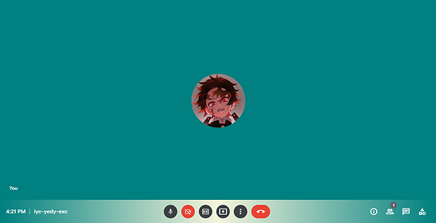

## Google Meet Custom Color
 Change background and toolbar color for google meet with bookmarklet  
 - convert [code.js](https://raw.githubusercontent.com/voltrare/googlemeet-custom-color/main/code.js) into bookmarklet [here](https://caiorss.github.io/bookmarklet-maker/)
 - paste the contents of  in the url section  
 
 >   

## Credits
 * Converted into bookmarklet using https://caiorss.github.io/bookmarklet-maker/ 
 * black and white @ https://stackoverflow.com/questions/38833212/how-can-i-change-the-font-color-of-all-texts-of-your-website-using-javascript/38833684
 * etc
